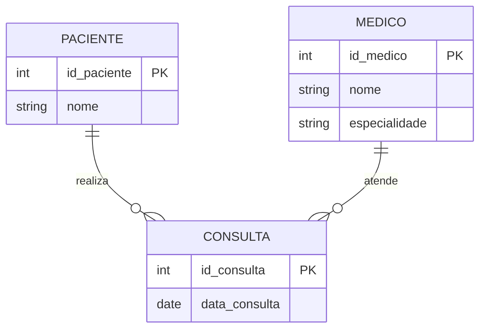

```mermaid
erDiagram

    PACIENTE {
        int id_paciente PK
        string nome
    }

    MEDICO {
        int id_medico PK
        string nome
        string especialidade
    }

    CONSULTA {
        int id_consulta PK
        date data_consulta
    }

    PACIENTE ||--o{ CONSULTA : realiza

    MEDICO ||--o{ CONSULTA : atende
```
